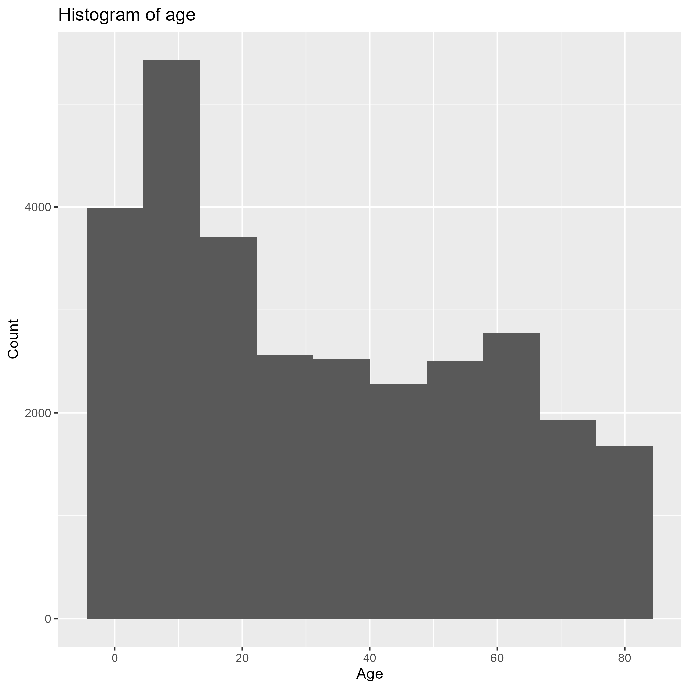

```{r setup, include=FALSE}
knitr::opts_chunk$set(echo = TRUE)
pacman::p_load(rio, here, tidyverse, dplyr, RColorBrewer, cowplot, ggpubr, gghighlight, grid, scales, skimr, DT, flexdashboard)
nhanes_data <- import(here("data", "cleaned_NHANES.csv"))
``` 

Row {data-height=650}
---------------------------------------
### Histogram of age variable - NHANES data



Row {data-height=350}
---------------------------------------
### Chart 2


### Chart 3
